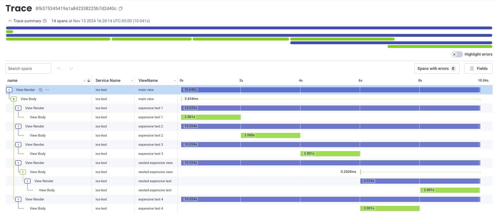

# Honeycomb OpenTelemetry Swift

[](https://github.com/honeycombio/home/blob/main/honeycomb-oss-lifecycle-and-practices.md)
[](https://circleci.com/gh/honeycombio/honeycomb-opentelemetry-swift)

Honeycomb wrapper for [OpenTelemetry](https://opentelemetry.io) on iOS and macOS.

**STATUS: this library is EXPERIMENTAL.** Data shapes are unstable and not safe for production. We are actively seeking feedback to ensure usability.

## Getting started

### Xcode

If you're using Xcode to manage dependencies...

  1. Select "Add Package Dependencies..." from the "File" menu.
  2. In the search field in the upper right, labeled “Search or Enter Package URL”, enter the Swift
     Honeycomb OpenTelemetry package url: https://github.com/honeycombio/honeycomb-opentelemetry-swift
  3. Add a project dependency on `Honeycomb`.

### Package.swift

If you're using `Package.swift` to manage dependencies...

1. Add the Package dependency.

```swift
    dependencies: [
        .package(url: "https://github.com/honeycombio/honeycomb-opentelemetry-swift.git",
                 from: "0.0.1-alpha")
    ],
```

2. Add the target dependency.

```swift
    dependencies: [
        .product(name: "Honeycomb", package: "honeycomb-opentelemetry-swift"),
    ],
```

### Initializing the SDK

To configure the SDK in your `App` class:
```swift
import Honeycomb

@main
struct ExampleApp: App {
    init() {
        do {
            let options = try HoneycombOptions.Builder()
                .setAPIKey("YOUR-API-KEY")
                .setServiceName("YOUR-SERVICE-NAME")
                .build()
            try Honeycomb.configure(options: options)
        } catch {
            NSException(name: NSExceptionName("HoneycombOptionsError"), reason: "\(error)").raise()
        }
    }
}
```

To manually send a span:
```swift
    let tracerProvider = OpenTelemetry.instance.tracerProvider.get(
        instrumentationName: "YOUR-INSTRUMENTATION-NAME",
        instrumentationVersion: nil
    )
    let span = tracerProvider.spanBuilder(spanName: "YOUR-SPAN-NAME").startSpan()
    span.end()
```

## Auto-instrumentation

The following auto-instrumentation libraries are automatically included:
* [MetricKit](https://developer.apple.com/documentation/metrickit) data is automatically collected.
* Some UIKit controls are automatically instrumented as described below.

### UIKit Instrumentation

#### Navigation

UIKit views will automatically be instrumented, emitting `viewDidAppear` and `viewDidDisappear` events. Both have the following attributes:

- `view.title` - Title of the view controller, if provided.
- `view.nibName` - The name of the view controller's nib file, if one was specified.
- `view.animated` - true if the transition to/from this view is animated, false if it isn't.
- `view.class` - name of the swift/objective-c class this view 
controller has.

#### Interaction

Various touch events are instrumented, such as:
* `Touch Began` - A touch started
* `Touch Ended` - A touch ended
* `click` - A "click". This is currently ony instrumented for `UIButton`s.

These events may have the following attributes. In the case of name attributes, we may walk up the view hierarchy to find a valid entry.
* `view.class`: e.g. `"UIButton"`
* `view.accessibilityIdentifier`, The `accessibilityIdentifier` property of a `UIView`, e.g. `"accessibleButton"`
* `view.accessibilityLabel` - The `accessibilityLabel` property of a `UIView`, e.g. `"Accessible Button"`
* `view.currentTitle` - The `currentTitle` property of a `UIButton`.
* `view.titleLabel.text` - The `text` of a `UIButton`'s `titleLabel`, e.g. `"Accessible Button"`
* `view.name`: The "best" available name of the view, given the other identifiers, e.g. `"accessibleButton"`

## Manual Instrumentation
### SwiftUI View Instrumentation

Wrap your SwiftUI views with `HoneycombInstrumentedView(name: String)`, like so:

```
var body: some View {
    HoneycombInstrumentedView(name: "main view") {
        VStack {
            // ...
        }
    }
}
```

This will measure and emit instrumentation for your View's render times, ex:



Specifically, it will emit 2 kinds of span for each view that is wrapped:

`View Render` spans encompass the entire rendering process, from initialization to appearing on screen. They include the following attributes:
- `view.name` (string): the name passed to `HoneycombInstrumentedView`
- `view.enderDuration` (double): amount of time to spent initializing the contents of `HoneycombInstrumentedView`
- `view.otalDuration` (double): amount of time from when `HoneycombInstrumentedView.body()` is called to when the contents appear on screen

`View Body` spans encompass just the `body()` call of `HoneycombInstrumentedView, and include the following attributes:
- `view.name` (string): the name passed to `HoneycombInstrumentedView` 
